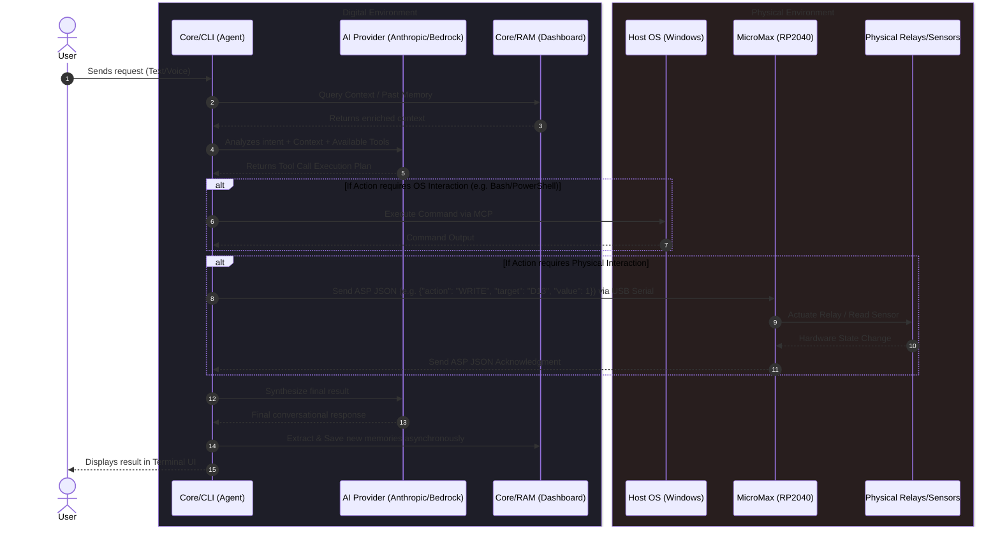

# 🏗️ APEX System Architecture

This document provides a detailed breakdown of the APEX repository structure and the data flow between its distributed components.

## 🗂️ Repository Structure

```text
P:\APEX\
├── Core/
│   ├── CLI/                  # 🧠 The "Brain": Primary AI Agent Engine
│   │   ├── src/
│   │   │   ├── entrypoints/  # Application entry logic (cli.tsx)
│   │   │   ├── commands/     # Slash commands (/voice, /plan, etc.)
│   │   │   ├── tools/        # MCP tools and native extensions
│   │   │   ├── bridge/       # Remote communication and cross-process bridging
│   │   │   └── components/   # Ink-based React terminal UI
│   │   ├── scripts/          # Build and deployment scripts (build.ts)
│   │   ├── tests/            # Python-based test suite (test_app.py)
│   │   └── package.json      # Dependencies (Bun, Ink, SDKs)
│   │
│   └── RAM/                  # 🗄️ The "Knowledge": Web Dashboard
│       ├── src/
│       │   ├── app/          # Next.js App Router
│       │   ├── components/   # React UI components
│       │   └── knowledge-base/ # Markdown/JSON data store
│       └── package.json      # Dependencies (Next.js, Tailwind)
│
├── MicroMax/                 # 🦾 The "Hands": Hardware Firmware
│   ├── src/
│   │   ├── main.cpp          # Main execution loop
│   │   ├── Communication.cpp # Apex Serial Protocol (ASP) handler
│   │   └── IO_Manager.cpp    # GPIO and Relay control
│   ├── include/              # C++ Headers
│   └── platformio.ini        # PlatformIO build configuration (RP2040)
│
└── IOT/                      # 🦴 The "Skeleton": Physical Hardware Design
    ├── IOT.kicad_pro         # KiCad Project File
    ├── IOT.kicad_sch         # Hardware Schematics
    └── IOT.kicad_pcb         # PCB Layout
```

### Component Details
1. **Core/CLI**: The central orchestrator. Written in TypeScript and executed via Bun. It handles user input (text or voice), communicates with LLM providers, and executes tool calls. It utilizes React and Ink for a rich terminal UI.
2. **Core/RAM**: A Next.js application that serves as a persistent, visual knowledge base and dashboard. It likely consumes data generated and compacted by the CLI.
3. **MicroMax**: Firmware written in C++ using the PlatformIO ecosystem, primarily targeting the Raspberry Pi Pico (RP2040). It listens for JSON-formatted commands over USB Serial to trigger physical relays or read sensors.
4. **IOT**: The electrical engineering layer containing KiCad schematics and PCB designs for the physical MicroMax boards.

## 🔗 Data Flow & Interaction

The following flowchart illustrates how a user request traverses the APEX ecosystem from a high-level digital intent down to a low-level physical action.



## 🔌 The Apex Serial Protocol (ASP)
Communication between `Core/CLI` and `MicroMax` occurs over a wired USB connection using a strict, newline-terminated JSON schema.
- **Baud Rate:** 115,200 (8-N-1)
- **Example Write:** `{"action": "WRITE", "target": "D13", "value": 1}`
- **Example Event:** `{"event": "TRIGGER", "source": "D2", "type": "Interrupt"}`
- **Heartbeat:** `{"query": "WHO_ARE_YOU"}`
